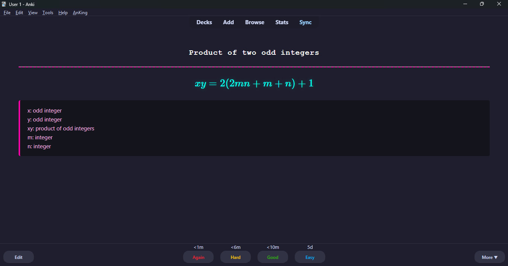
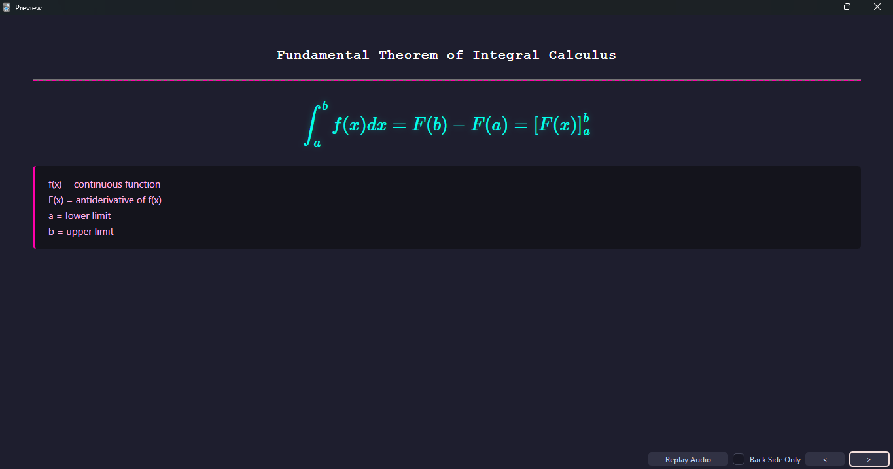

#  PDF-to-Anki Formula Scraper

I built this script because manually typing out math and science formulas into Anki is incredibly tedious and soul-crushing. 

If you've ever tried to copy-paste a formula from a PDF textbook, you know standard extractors usually turn it into unreadable garbage. This script fixes that. It uses Google's Gemini AI to literally "read" your chapter, extract every single formula, format it beautifully in LaTeX, and instantly generate a ready-to-use Anki deck (`.apkg`). 

Basically, it turns hours of flashcard creation into a 30-second script so you can get back to actually studying.

## 🫀 Why it's useful
* **Context Aware:** It doesn't just blindly rip math symbols. It understands the surrounding text and titles your flashcards properly (e.g., "Standard equation of an ellipse").
* **Flawless LaTeX:** Outputs clean, textbook-quality math equations.
* **Variable Breakdowns:** It automatically lists what every single letter means on the back of the card right under the formula.
* **Actually Stable:** I ditched standard JSON parsing for a custom text-block slicer, which means the script won't crash just because of a weird LaTeX backslash. 
## Card layout


## 🛠️ What you need
* Python 3.9+
* A free [Google Gemini API Key](https://aistudio.google.com/app/apikey)
* [Anki](https://apps.ankiweb.net/) installed on your device

## 🚀 How to set it up

1. **Grab the code:**
   Clone this repository or just download the `formulaetoanki.py` and `requirements.txt` files to a folder on your computer.

2. **Install the dependencies:**
   Open your terminal in that folder and run:
   ```bash
   pip install -r requirements.txt
